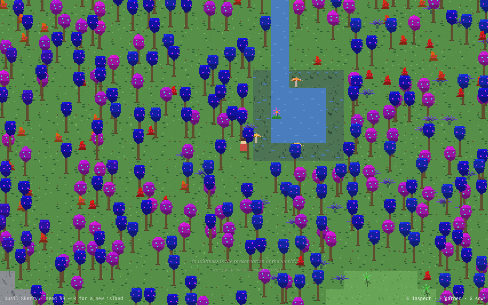
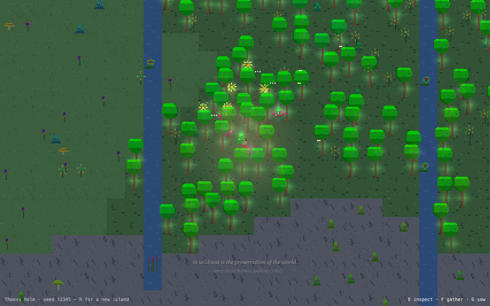
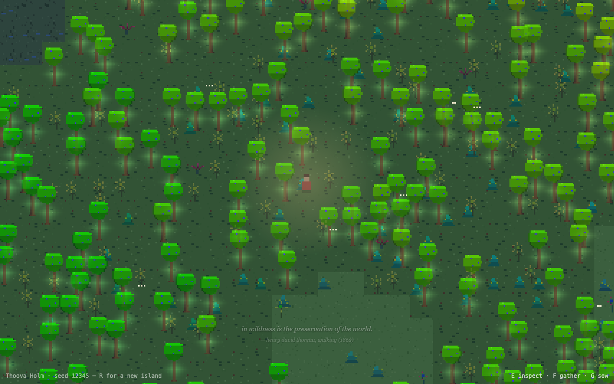
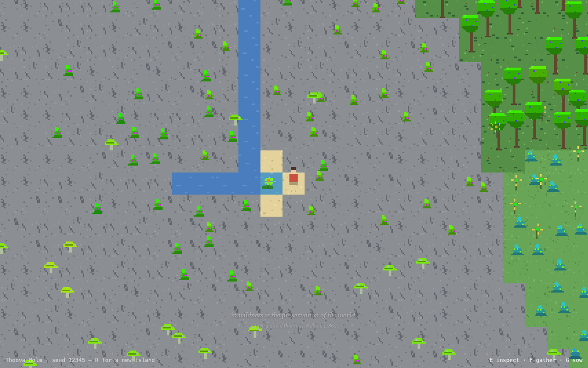
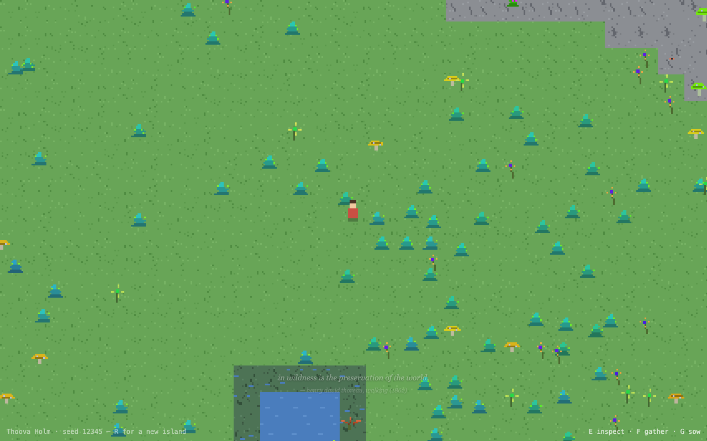
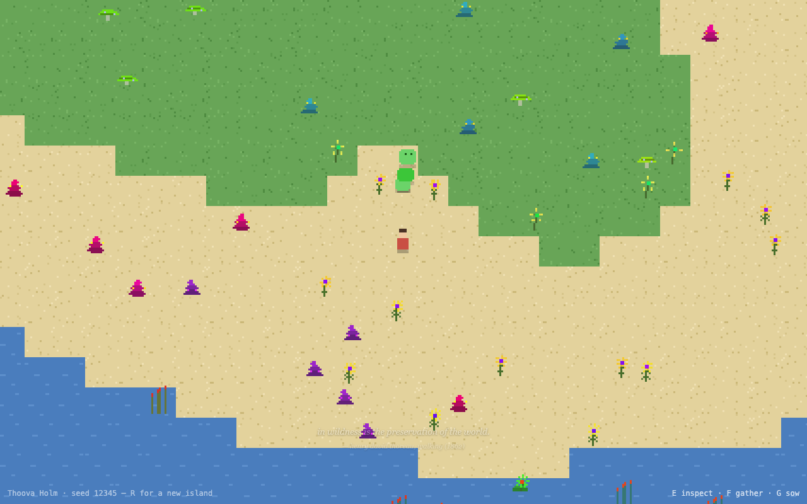
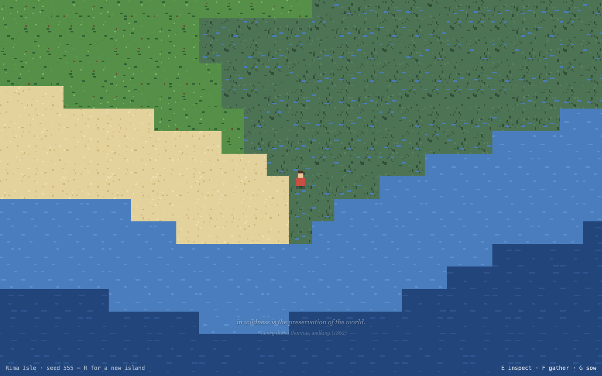
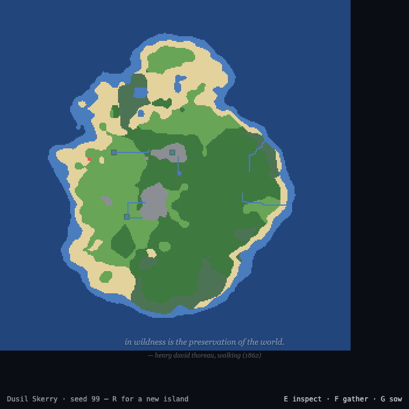

# Good morning ☀️

While you slept, the island came alive. Here's what's waiting for you.

## First, play

    npm run dev        # probably still running from last night

Open http://localhost:5173 — you'll land on a random island.
**WASD** walk · **E** inspect · **F** gather · **G** sow · **H** found a
home · **P** postcard · **R** new island (double-press; your world is
saved). Days last ~4 minutes; stay out after dusk.

This page in its evening clothes: `npm run report` regenerates
`docs/morning-report.html` from this markdown.

Worth visiting: `?seed=99` (the blue forest below), `?seed=12345`
(two pockets, two springs, and Lulu), `?seed=555` (fenland island).

## The tour

**Dusil Skerry (seed 99)** — no one chose these colors; the island's tree
species just rolled indigo and orchid, and drift did the rest:

**A pocket biome igniting at night** (seed 12345, hidden between two
rivers — ~60% of islands hide one, nothing marks them, you just find them):

**The glow forest after dark** — fungi light the understory and join into
faint mycelium threads; the wanderer carries a small lantern:

**A hot spring at the rock's edge** — steam, a warm teal pool, and a water
flower that colonized it on its own (shallow water is valid habitat; the
systems compose):

**Sanpo Tumbles at their den** — every critter species loves one plant and
dens where it grows:

**Lulu, the old wanderer** — seed 12345's beast. No den, no appetite, just
an endless slow crossing. She glows at night. She will sometimes stop and
look at you:

**A fenland coast** (seed 555) and **an island overview** (dev view,
`?overview=1`):

## What shipped overnight

Everything is committed to `master`, 76 unit tests green, zero runtime
dependencies, ~13 kB gzipped.

- **World**: named islands, per-seed silhouettes, rivers with deltas and
  pond-ring marshes, marsh biome, hot springs, hidden pocket biomes —
  **every island now holds at least one pocket**, and one island in five
  hides a single *deep pocket* instead: larger, denser, traits pushed
  further, faster shimmer, more spore motes
- **Flora**: 5 forms (flower/shrub/tree/fungus/fern, plus lily & reed
  aquatic forms), ~15 named species per island, genome drift in real time,
  **cross-pollination** (neighbors breed; planting is breeding), pocket
  amplification, one ✶ sport per island
- **Fauna**: 3 critter species with dens/foraging/curiosity/blinks; the
  beast; butterflies by day, moths by night; **birds** that wheel over the
  island, perch, roost at night, and flush when you walk in among them
  (Hopkins murmur); **fish** gliding in the shallows that scatter from
  your wading steps; **frogs** on the banksides that plop into the water
  with spreading rings when you come close
- **Light**: 4-minute days, glow genomes shining after dark, mycelium
  threads, cloud shadows, the lantern
- **You**: inspect panel with drift readings, seed pouch, sowing, postcards
- **Murmurs**: 20 gathered voices (Thoreau, Darwin, Bashō, Dickinson,
  Whitman, van Gogh…) surfacing at first-times: new biome, stillness,
  night, the sport, the beast, the spring

The full design record is in `docs/superpowers/` (specs + plans) and the
idea backlog in `docs/ideas.md`.

## Your worlds are safe now

- **Autosave.** Every world saves itself (each 10s, on leaving, and before
  sailing): all the drifted genomes, your position, your seed pouch, your
  home. The last 8 worlds you visited are kept; revisit any via `?seed=N`.
- **R asks first.** Press R once and the island tells you it's saved and
  asks for a second press before sailing.
- **Worlds live while you're away.** When you return to a saved island,
  the time you were gone is simulated forward (up to ~4 hours of island
  time) — plants have reseeded, crossed, and drifted without you. This is
  the browser-only version of "keep a world running." If you want more, two
  honest roads: a small export/import of save files plus a headless node
  runner that ages a world on a schedule (the sim is pure TypeScript, so
  this is easy), or eventually a tiny server. Say which appeals.
- **H founds a home.** Press H on good ground: a 3×3 garden bed takes
  shape — corner stones, turned earth, a Frost murmur. Plants sown inside
  are *tended*: never thinned by crowding, and they breed twice as fast
  (with cross-pollination, your garden is a breeding bench). Genetics
  nudging — pick two parents, bias their cross — is sketched and waiting
  for you to go deep with me.

## How this works (the fun version)

The whole game is one number growing consequences.

1. **The seed** feeds a hash; the hash feeds layered noise; the noise,
   shaped by a per-seed lopsided falloff, becomes elevation. Where water
   sits in it becomes sea, shore, marsh; where it rises becomes rock and
   snow. Rivers are just water obeying "step downhill" until it can't.
2. **Species are rolled, not drawn.** Each island generates ~15 plant
   species: a form (flower, shrub, tree, fungus, fern), a habitat, and an
   archetype genome — ten numbers (hue, height, petals, glow…). The pixel
   art is *painted from the numbers* at runtime; no sprite sheet exists.
3. **Every individual drifts.** Plants reseed with small mutations; nearby
   same-species plants cross, meeting in the middle of their traits (hues
   travel the short way round the color wheel). Geography plus time equals
   gradients you can walk through. Glow past a threshold and the plant
   literally lights up at night.
4. **The island self-regulates.** Past a comfortable density it quietly
   thins the commonest plants (never the rare ones, never your garden), so
   an old world stays composed instead of becoming jungle wallpaper.
5. **Everything else listens.** Critters den where their favorite plant
   thrives; birds flush from your footsteps; moths follow the glow;
   murmurs surface when a moment matches their tag. Nothing is scripted to
   happen *at* you — things happen *near* you, which is why it feels alive.

Same seed, same island, forever — your saves just remember what time and
you did to it.

## Decisions waiting for your taste

1. **Field journal** (J) — my top pick for the next step: a self-writing
   memoir of every species you've met, renameable, per-seed memory.
2. **The wanderer's home** — where does it live, what is it for? (My
   instinct: a porch, a garden bed, a place the camera rests — not a base.)
3. **Critter trust** — feeding favorites → follow → they lead you to
   secrets. How tame should wild things get?
4. **Sound** — generative wind/footsteps/critter motifs. Big mood win,
   real scope.
5. **Cross-island seeds** — should one pouch slot survive `R`? (Invasive
   species as gameplay.)
6. Anything on the island that made you feel something — tell me what, and
   that's the direction.

— written at the end of the night shift, with the loop still ticking
