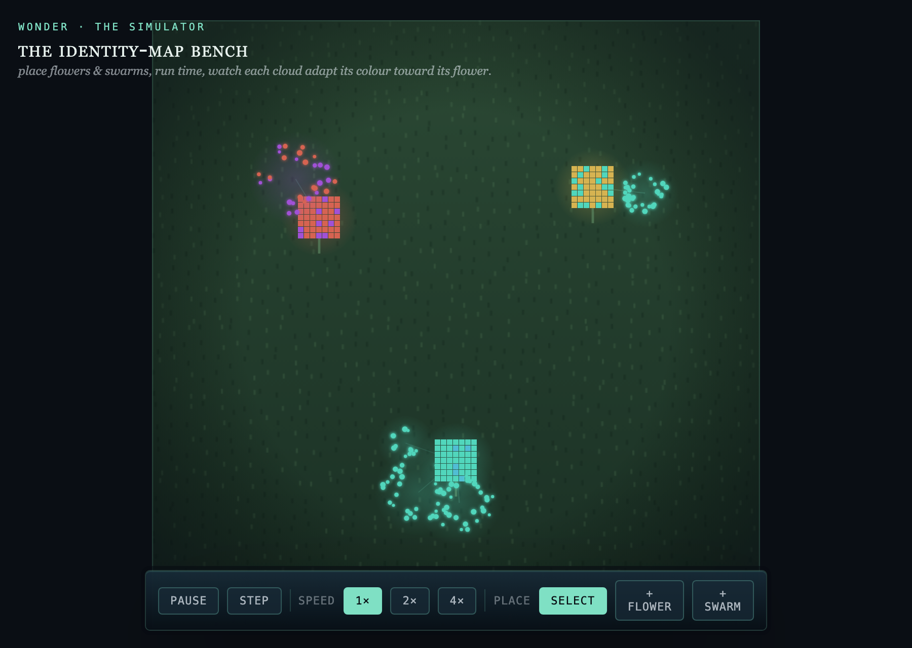
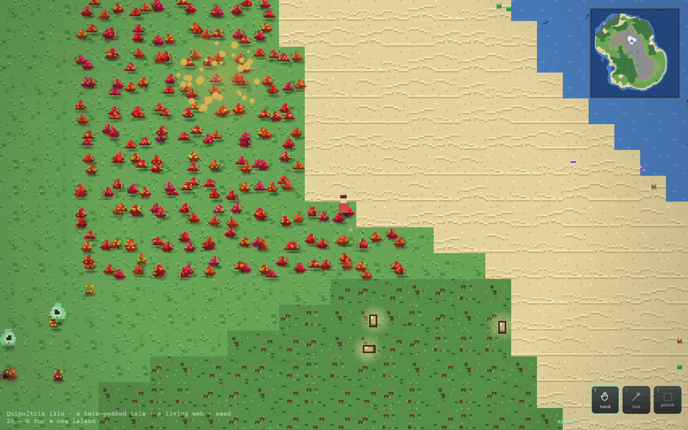
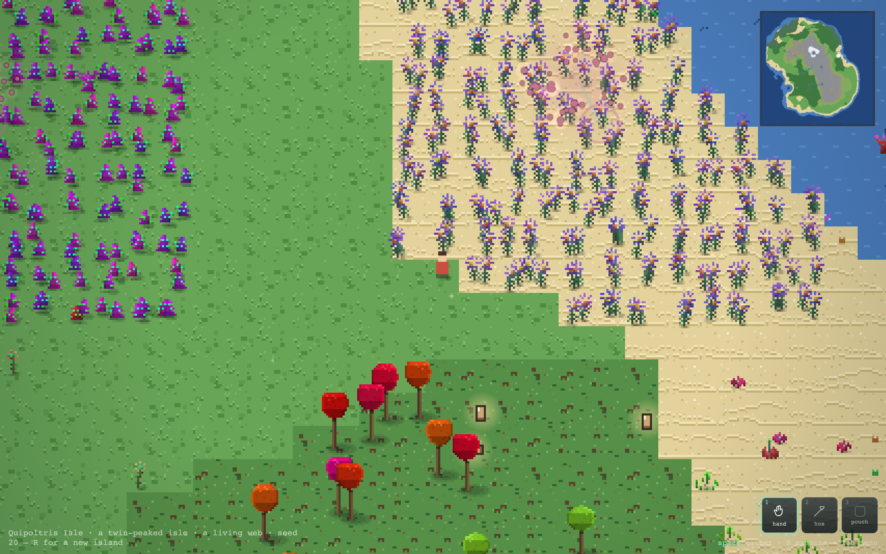
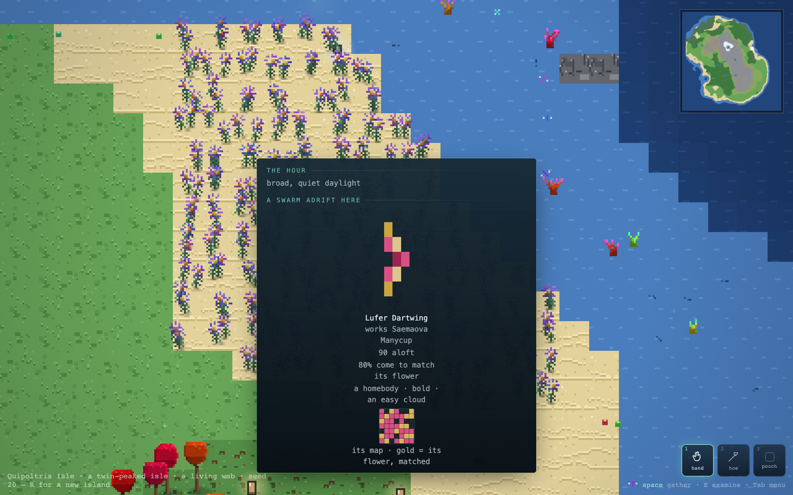
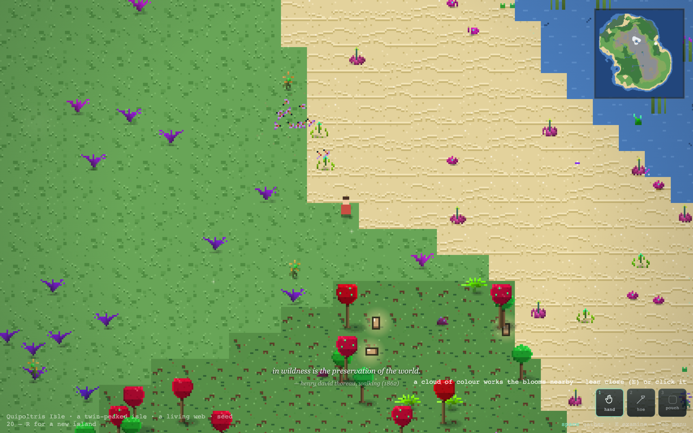
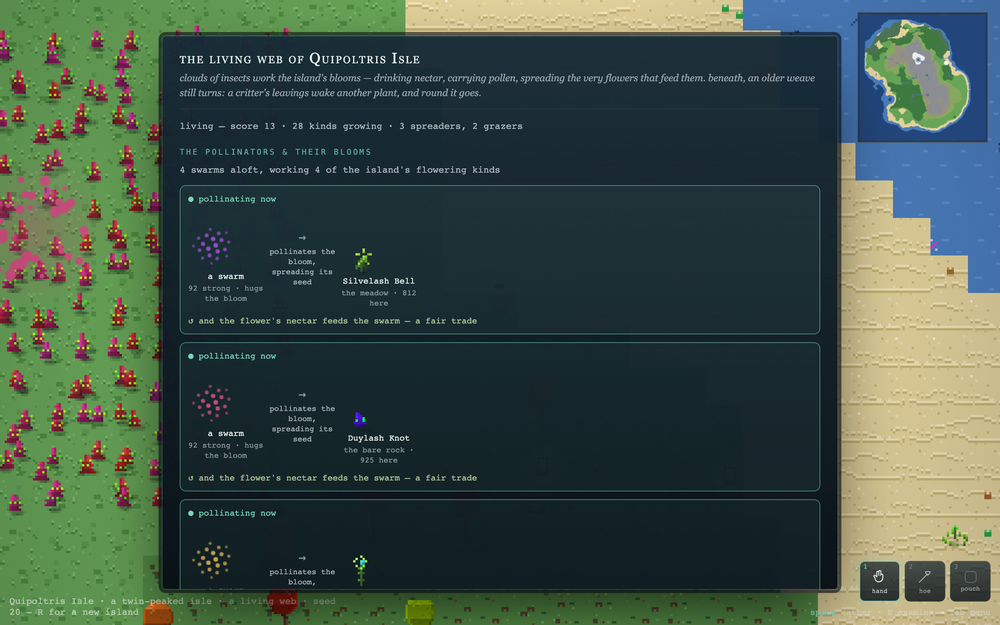

# Wonder — The Plant/Insect Ecology: how it works (and how to tweak it)

*A technical read for the morning. Every formula and every tunable constant, with
worked numbers and screenshots. Written 2026-07-22 against `master`. Design specs:
[`2026-07-21-plant-insect-ecology-design.md`](specs/2026-07-21-plant-insect-ecology-design.md),
[`2026-07-21-simulator-design.md`](specs/2026-07-21-simulator-design.md).*

> **TL;DR of the loop.** Each **flower** shows a little pixel **map**. Each insect
> **swarm** carries a **sensor map** it evolves to match that flower. Matching the
> flower = **energy** (feeding) = **camouflage** = the swarm **pollinates** the
> plant, spreading it faster. Predators thin the *conspicuous*. A well-matched
> pair **booms** together; a mis-matched one scrapes by. Everything is bounded so
> it holds at a lush ceiling instead of exploding or collapsing.



---

## 0. The pieces & where they live

| Piece | File | What it is |
|---|---|---|
| The identity map (pure math) | `src/life/idmap.ts` | the 7×7 tag grid, matching, reward, efficiency |
| The swarm + flower (pure sim) | `src/life/swarm.ts` | gene pool, feeding, population, predation |
| The world layer | `src/game/swarms.ts` | swarms on real islands: spawn, home on blooms, pollinate, diverge |
| Plant propagation | `src/life/flora.ts` | `pollinateSpread` (the plant's payoff) + normal self-seeding |
| Insect sprites | `src/render/insectSprites.ts` | generative bug bodies from the genome |
| Draw / inspect | `src/render/renderer.ts`, `inspect.ts` | the flitting clouds + the examine card |

**Timescale.** One **heartbeat** = one sim tick = **2 seconds** (`SIM_MS = 2000` in
`main.ts`). One heartbeat = one feed + **one gene-pool generation** + one population
update per swarm. All "per tick" numbers below are per 2 s of real time.

---

## 1. The map, and what a "match" is

A map is a **7×7 = 49-cell** grid (`MAP_G = 7`). Each cell is **0 = neutral** or a
**colour 1..6** (`MAP_NCOL = 6`).

- A **flower** presents a map: a **base/foliage colour** fills most cells, and a
  **flower accent** (a distinct colour) is stamped on a few cells — those accent
  cells are the *jackpot*. Flower size = how many accent cells.
- A **swarm** carries a **sensor map** that starts mostly neutral (a cheap
  generalist) and evolves toward a flower's map. **The insect's visible colours are
  rendered from this sensor map** — so as it adapts, the bug literally becomes its
  flower.

### The reward function — `matchReward(sensor, flower)`

Walk all 49 cells and sum:

```
per cell:
  sensor cell is NEUTRAL (0)      →  + GENERIC        (a tiny income, works on ANY flower)
  sensor cell is COLOURED         →  − UPKEEP         (costs energy to hold a colour)
        and it matches a BASE cell →  + BASE_HIT      (generic match, small)
        and it matches an ACCENT   →  + FLOWER_HIT    (the flower jackpot, big)
```

with the current weights (`idmap.ts`):

| constant | value | net per matched cell |
|---|---|---|
| `GENERIC` | **0.02** | neutral cell, free income |
| `UPKEEP` | **0.10** | cost of any coloured cell |
| `BASE_HIT` | **0.20** | base match → net **+0.10** |
| `FLOWER_HIT` | **0.90** | accent match → net **+0.80** |

So a **neutral generalist** earns a little from every flower; a **specialist** that
paints its cells to match a flower earns a lot *from that flower* — the accent
cells 8× more than the base cells. A coloured cell that matches *nothing* is
**−0.10** wasted, which is what makes specialising *toward one flower* the winning
move (and, because your colours are your look, what makes you camouflaged on it).

### Metabolic efficiency — the 0..1 number everything scales by

```
metabolicEfficiency = clamp( matchReward / maxReward , 0 , 1 )
```

where `maxReward` is the score of a perfect mimic (every cell coloured to match).
**This is the master dial**: 0 = a naive/mismatched cloud, 1 = a perfect mimic.
A fresh random swarm sits around **~0.11** (the generalist floor from all those free
neutral cells); a fully adapted one reaches **~1.0**.

### Resemblance & conspicuousness (camouflage)

```
resemblance   = (flower-coloured cells the sensor reproduces) / (flower-coloured cells)   // 0..1
conspicuousness = 1 − resemblance                                                          // 0..1
```

Resemblance is what the examine card shows as "**% come to match its flower**".
Conspicuousness is how much it *stands out on the plant it's on* — the predation
handle (§5).

---

## 2. What "energy" is, and how it's gained

**Energy is the swarm's metabolic reserve, a single number in `[0,1]`** (`sw.energy`).
It rises when the swarm feeds, falls a fixed amount just from living, and it's what
the population chases (§4). It is *not* stored food units — think of it as
"how well-fed the cloud is right now."

### Feeding — `feedSwarm(sw, flower)` (the "how much energy do they gain" answer)

Every heartbeat a swarm draws nectar from the flower it works and converts it:

```
drawn   = min(flower.nectar, NECTAR_DRAW)        // take up to a cap
flower.nectar -= drawn                            // the flower is depleted…
boldness = 0.6 + 0.4 · nerve                      // a bold swarm works the flower harder (0.6–1.0)
gain    = drawn · metabolicEfficiency · FEED_VALUE · boldness
sw.energy = min(1, sw.energy + gain)
```

Nectar regenerates on the flower: `flower.nectar = min(1, nectar + NECTAR_REGEN)` each tick.

| constant (`swarm.ts`) | value | meaning |
|---|---|---|
| `NECTAR_REGEN` | **0.05** /tick | a flower's productivity (the real ceiling on income) |
| `NECTAR_DRAW` | **0.25** | most nectar an insect takes in one feed |
| `FEED_VALUE` | **4** | energy per unit nectar at full efficiency |
| `LIVING_COST` | **0.02** /tick | energy burned just living (see §4) |

**Worked numbers** (why it's balanced):
- *Well-adapted, full flower:* `gain = 0.25 · 1.0 · 4 · (0.6–1.0) = 0.6–1.0` → energy
  pins at 1 almost instantly → population climbs to the cap. It thrives.
- *Naive generalist (eff ≈ 0.11), steady state:* a flower can only *produce* ~`0.05`
  nectar/tick, so once it's been grazed the sustainable draw ≈ `0.05`. Income ≈
  `0.05 · 0.11 · 4 · 0.8 ≈ 0.018` — almost exactly `LIVING_COST (0.02)`. So a
  clueless cloud **breaks even and survives** (barely) while it adapts, but doesn't
  grow. **This is the knob that decides "can a naive swarm survive long enough to
  learn?"** — raise `GENERIC`/`FEED_VALUE`/`NECTAR_REGEN` or lower `LIVING_COST` to
  make the world kinder to beginners; do the opposite to make adaptation urgent.

---

## 3. Reproduction — three distinct mechanisms

Blaine, this is the part with three different "reproduction" senses; keep them separate:

**(a) The gene pool evolves (this is the real adaptation).** A swarm isn't one
genome — it's a small **pool of `POOL_SIZE = 10`** sensor maps. Each heartbeat,
`evolveSwarm`:
```
sort the 10 by matchReward(against the home flower)
keep the top half (5 survivors)
refill to 10 by MUTATED COPIES of survivors   // mutateMap flips MUTATE_FLIPS = 3 random cells
sensor = the best genome                       // what you see / the card shows
```
That's a genetic algorithm: better-matched variants out-reproduce the rest, so the
pool drifts toward the flower. **`MUTATE_FLIPS` = adaptation speed & noise**; a
bigger pool or more flips = faster, jitterier learning.

**(b) The population number tracks energy** (the cloud gets denser/sparser) — §4.
This is *not* literal births; it's a size proxy.

**(c) Divergence buds a new swarm (speciation).** When a swarm's pool splits between
two flowers, it buds a **cousin** — a whole new swarm — §6.

---

## 4. Population — `updatePopulation(sw)`

```
sw.energy -= LIVING_COST                      // 0.02/tick, living costs
target     = sw.energy · sw.cap               // how big the current energy can support
sw.population += (target − sw.population) · 0.05   // ease 5% toward target each tick
clamp population to [0, sw.cap]
```

- **`cap` is the size lever** (`SWARM_CAP` — 100 in the core, **96** for a world
  swarm; the Simulator exposes a slider). Population is the cloud density and the
  count in "N aloft".
- The `· 0.05` is inertia: population moves ~5%/tick toward its target, so booms and
  busts are smooth, not instant.

---

## 5. Predation — gentle, non-wiping (the peaceful pillar)

Insectivory is a **population drain proportional to how conspicuous a swarm is** —
never a discrete kill. `applyPredation(sw, flower, pressure)`:

```
exposure = 0.4 + 0.6 · nerve                  // bold clouds linger exposed (0.4–1.0)
taken    = sw.population · conspicuousness · pressure · PREDATION_RATE · exposure
sw.population -= taken
```

| constant | value | where |
|---|---|---|
| `PREDATION_RATE` | **0.02** | `swarm.ts` — fractional loss/tick at full exposure×pressure |
| `WORLD_PREDATION` | **0.6** | `swarms.ts` — the ambient pressure in a real island (the Simulator toggles its own) |

A **camouflaged** swarm (conspicuousness ≈ 0) loses ≈ nothing; an **exposed** one is
thinned but **regrows once hidden/fed** — so adaptation *is* survival, and nothing is
ever wiped out. **`WORLD_PREDATION` is the "how dangerous is the world" dial**; 0
removes insectivory entirely, 1 makes camouflage urgent.

---

## 6. Divergence → cousins

Every **`DIVERGE_INTERVAL = 50` heartbeats** (~100 s) a swarm checks whether its pool
is genuinely bimodal — half favouring its flower, half favouring a *different* nearby
flowering species. If so it **buds a cousin** (a new swarm carrying the second
cluster, mutated behaviour, 40% of the population). Hard-capped at
**`SWARM_COUNT_CAP = 24`** swarms per island. This is how one kind becomes many over
island-time; cousins wear a ✧ in their name.

---

## 7. The plant's payoff — pollination vs. going it alone

This is the "**benefits to the plant vs non-insect behaviour**" answer, and it's the
whole mutualism.

**Without insects, a plant still lives** — `flora.simTick` self-seeds every plant on
its own (drift within a small `reseedRadius`). That's the **facultative floor**: a
flower with no swarm persists, just spreads *slowly*. (Guarded by a test: all
flowering kinds survive 800 self-seed-only ticks.)

**With a well-fed, well-matched swarm, the plant spreads faster.** Each heartbeat, in
`SwarmLayer.tick`, a swarm working a flower rolls to pollinate it:

```
match = metabolicEfficiency(swarm, flower)
if match ≥ POLLINATE_MATCH_MIN (0.3):                       // a starving stray never pollinates
    fill = population / cap                                  // a fuller cloud pollinates more
    if rng() < POLLINATE_CHANCE · match² · fill:            // 0.5 · match² · fill
        flora.pollinateSpread(host, radius=6, maxSame=2)     // the plant's ordinary propagation, tripped
island-wide ≤ MAX_POLLINATIONS_PER_TICK (3) pollination events per heartbeat
```

`pollinateSpread(p, radius, maxSame)` (in `flora.ts`) is like normal reseeding but
**wider and lower-density**: it drifts a mutated child up to **6 tiles** away and
**refuses any tile that already holds ≥2** of that species (below flora's own
per-tile cap of 4), so the boom reads as **airy spread, not a tiled slab**. It still
routes through `addPlant`, so per-tile + global caps and the habitat gate all hold.

| constant (`swarms.ts`/`flora.ts`) | value | meaning |
|---|---|---|
| `POLLINATE_MATCH_MIN` | **0.3** | efficiency needed before a swarm pollinates at all |
| `POLLINATE_CHANCE` | **0.5** | base per-swarm per-tick pollination probability |
| chance formula | `0.5 · match² · fill` | quadratic in match → rewards *good* mimics steeply |
| `MAX_POLLINATIONS_PER_TICK` | **3** | island-wide ceiling (keeps booms bounded) |
| `POLLINATE_SPREAD_RADIUS` | **6** tiles | drift of a pollinated seed (wider than self-seed) |
| `POLLINATE_MAX_SAME` | **2** /tile | density cap so it's spread, not a carpet |

**The reciprocal boom.** Match → the swarm feeds (population up) *and* pollinates
(the plant spreads → more flowers → more nectar → more feeding → …). Positive
feedback, **bounded** by per-tile caps + nectar limits + predation. A "well-versed
pair grows rapidly," then settles at a lush ceiling. Verified bounded: a full island
run holds ~8000 plants, peaks < the 10 000 cap, never collapses.



**So, plant with a swarm vs without:** same survival floor, *much* faster spread when
a matched cloud is working it — and the flowers a swarm favours come to dominate,
which is the co-adaptation ("the island leans toward what its pollinators love").

---

## 8. Behaviour genes — personality (and the one that bites the sim)

Each swarm has three scalar genes in `[0,1]` (`BehaviorGenes`), heritable + mutated on
divergence:

| gene | 0 ↔ 1 | wired effect |
|---|---|---|
| **nerve** | skittish ↔ bold | **feeding** `boldness = 0.6+0.4·nerve` *and* **exposure** `0.4+0.6·nerve` — bold clouds feed harder but are thinned more (a real trade-off; predation selects skittish, scarcity selects bold) |
| **range** | homebody ↔ wanderer | render motion: dart length / how far the cloud roams its bloom |
| **cohesion** | loose ↔ tight | render motion: how tightly the insects cluster |

`range` and `cohesion` currently express in *motion + the sprite roll* (which body
plan), not yet in the sim numbers — that's where you'd wire more trade-offs (e.g.
wanderers reaching farther flowers, tight clouds harder for predators to pick from).
The examine card renders these as words ("a homebody · bold · an easy cloud").

---

## 9. World integration & spawning (so numbers match what you see)

`SwarmLayer` (in `swarms.ts`) runs off its **own salt** (`SWARM_SALT = 0x5a12b`) so it
is **seed-safe**: a pinned island's terrain/flora/critters are byte-identical with or
without swarms. Flower maps use a separate `FLOWER_SALT` per species (daughters get a
lazily-built map, so evolved kinds host swarms too).

| constant | value | meaning |
|---|---|---|
| `MIN_SWARMS` / `MAX_SWARMS` | **4 / 8** | swarms spawned per island |
| `SPARSE_SWARMS` | **2** | fallback so a bloom-poor island still has some life |
| `WARM_TICKS` | **20** | heartbeats a swarm has already lived on load (arrives partly adapted) |
| `LIVELY_POP` | **38** | arrival population (a lush cloud, not a lone speck) |
| `HOME_SCAN_PX` | **10 tiles** | how far a swarm looks for a flower to work |
| `SWARM_CAP` (world) | **96** | the world size lever |
| `BOOM_POLLINATIONS` | **3** | spreads before a swarm's work "reads as a boom" (fires a murmur/journal note) |

Under `?warm=N` the swarm layer lives the tail of the fast-forward too, so a warmed
island loads already booming.

---

## 10. Every tunable, in one place

*Raise/lower these to retune. Files: `i` = `idmap.ts`, `s` = `swarm.ts`,
`g` = `swarms.ts`.*

| knob | file | value | turn it UP → | turn it DOWN → |
|---|---|---|---|---|
| `GENERIC` | i | 0.02 | naive swarms feed more anywhere (kinder, less specialisation pressure) | specialise-or-starve |
| `UPKEEP` | i | 0.10 | colours cost more → leaner sensors, weaker mimics | mimics fill in denser |
| `BASE_HIT` | i | 0.20 | camouflage/foliage-matching more worthwhile | flower-only focus |
| `FLOWER_HIT` | i | 0.90 | the jackpot dominates → sharp specialists | flatter reward |
| `NECTAR_REGEN` | s | 0.05 | flowers feed more → bigger populations, faster booms | scarcer, leaner islands |
| `NECTAR_DRAW` | s | 0.25 | burstier feeding | smoother |
| `FEED_VALUE` | s | 4 | more energy/food → faster growth | slower growth |
| `LIVING_COST` | s | 0.02 | harsher (starvation pressure) | everything survives easily |
| `SWARM_CAP` | s/g | 100/96 | **bigger swarms** (the size lever) | smaller swarms |
| `POOL_SIZE` | s | 10 | more internal variation → faster adaptation | slower, more drift |
| `MUTATE_FLIPS` | s | 3 | faster + jitterier adaptation | slower, cleaner |
| `PREDATION_RATE` | s | 0.02 | harder predation | gentler |
| `WORLD_PREDATION` | g | 0.6 | camouflage more urgent (0 = off) | safer world |
| `POLLINATE_MATCH_MIN` | g | 0.3 | only strong mimics pollinate | even mediocre ones help the plant |
| `POLLINATE_CHANCE` | g | 0.5 | plants spread faster under swarms | weaker mutualism |
| `MAX_POLLINATIONS_PER_TICK` | g | 3 | bigger booms | subtler |
| `POLLINATE_SPREAD_RADIUS` | g | 6 | booms spread wider/thinner | tighter clumps |
| `POLLINATE_MAX_SAME` | g | 2 | denser carpets | airier spread |
| `DIVERGE_INTERVAL` | g | 50 | (lower) cousins bud more often | rarer speciation |
| `SWARM_COUNT_CAP` | g | 24 | more total swarms per island | fewer |
| `WORLD_PREDATION`→nerve wiring | s | 0.4–1.0 exposure | — | — |

---

## 11. What you see (and where to look in-game)

- **In the world:** clouds of generative insects flit and **perch on the blooms they
  work**; a well-adapted cloud takes on its flower's palette (so it gets *subtler* as
  it succeeds — camouflage working). 
- **Lean close (`E`) or click a cloud:** its examine card — a **portrait** of the
  actual bug, its name, host flower, population ("N aloft"), resemblance ("% come to
  match its flower"), and personality, with the genome grid as a small inset.
  
- **First meeting:** a HUD cue + a murmur point you at the swarms.
  
- **`C` the living web:** leads with **swarm → pollinates → bloom → nectar feeds the
  swarm**; the old substrate chains sit demoted below.
  
- **`G` the ledger:** a swarm-population line over island-time (the boom as a curve).
- **`?sim=1` / Tab → the Simulator:** place flowers & swarms, run time, toggle
  Predators, dial the size Cap, watch a cloud find and *become* its flower.

---

## 12. Where I'd tweak first (suggestions)

- **To make adaptation feel more consequential:** lower `GENERIC` (0.02 → 0.01) and
  raise `LIVING_COST` (0.02 → 0.03) so a naive cloud is genuinely pressured — but
  watch it doesn't dip below break-even (§2 math) or clouds will thin before they
  learn.
- **To make the boom more/less dramatic:** `POLLINATE_CHANCE` and
  `MAX_POLLINATIONS_PER_TICK` are the volume knobs; `POLLINATE_SPREAD_RADIUS` /
  `POLLINATE_MAX_SAME` are the *shape* (airy vs. dense).
- **To make camouflage matter more:** raise `WORLD_PREDATION` toward 1.0 — exposed
  clouds get thinned harder, so matching the flower buys real survival, not just food.
- **The unbuilt richness (v2):** the **dual insect map** (a separate food map vs.
  camouflage map, so feeding and hiding can *conflict*) and an **evolving-predator
  search image** — these turn the current "harmonious" adaptation into a genuine arms
  race. Say the word and I'll build them.

*Any of these is a one-line change; the tests (`ecology-holds`, `pollination`,
`swarm-layer`) will catch a retune that breaks the balance.*
